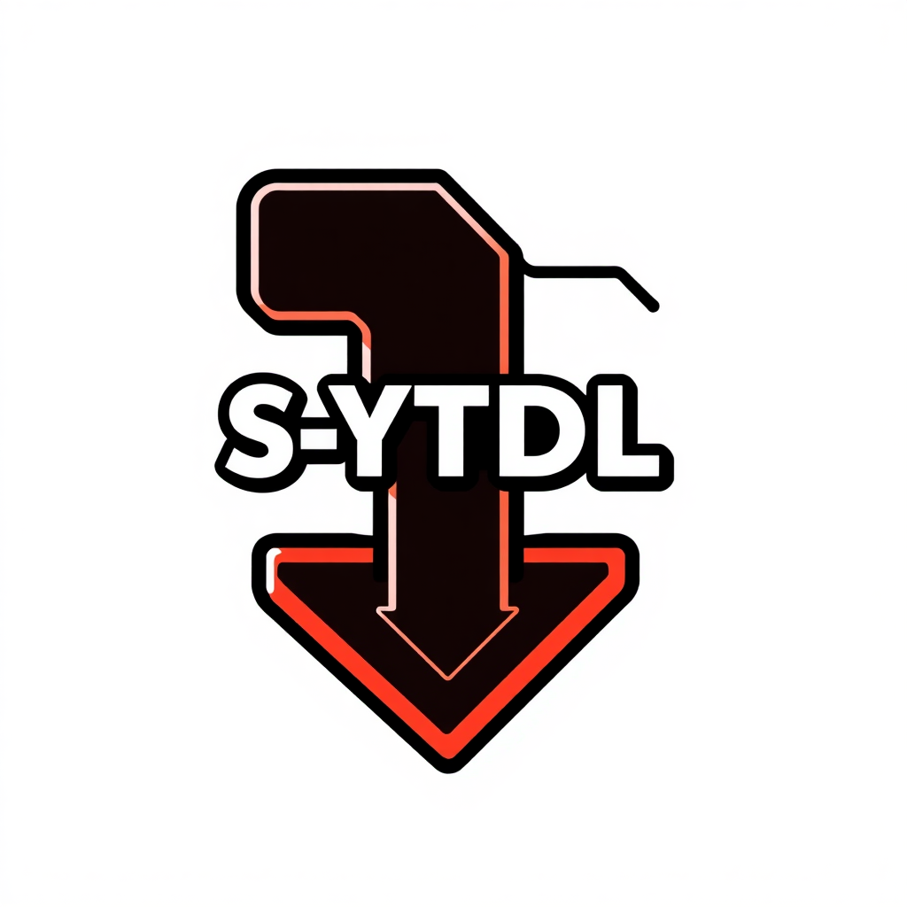

<div align="center">
  
# 🎯 SYTDL



### 🚀 Pengunduh YouTube Generasi Baru

[](https://www.npmjs.com/package/s-ytdl)

*Dibuat dengan 💖 oleh [< Sxyz - Zenith />](https://github.com/sxyz-dev)*

</div>

---

## ✨ Fitur Unggulan

- 🎮 **API Super Sederhana** - Unduh hanya dengan 3 parameter
- 🎵 **Audio Premium** - Kualitas audio jernih hingga 192kbps
- 🎥 **Video Berkualitas Tinggi** - Resolusi mencapai 4K (2160p)
- ⚡ **Super Cepat** - Proses unduhan yang optimal
- 🛠️ **Mudah Digunakan** - Tanpa konfigurasi rumit
- 📱 **Fleksibel** - Mendukung berbagai format dan kualitas

## 🚀 Cara Pemasangan

```bash
# Menggunakan npm
npm install s-ytdl

# Menggunakan yarn
yarn add s-ytdl

# Menggunakan pnpm
pnpm add s-ytdl
```

## 📖 Cara Penggunaan

### Contoh Dasar

```javascript
import SYTDL from "s-ytdl";

// Fungsi async untuk mengunduh
(async () => {
    // Unduh Audio
    const audio = await SYTDL.dl(
        "https://youtu.be/O2QiUN-7Rjw?si=B5RCHEfk__K1ywjH", // Link YouTube
        "4",  // Kualitas (192kbps)
        "audio" // Tipe unduhan
    );

    // Unduh Video
    const video = await SYTDL.dl(
        "https://youtu.be/O2QiUN-7Rjw?si=B5RCHEfk__K1ywjH",
        "5", // Kualitas (720p)
        "video"
    );
})();
```

## 📊 Pilihan Kualitas

### 🎵 Kualitas Audio
| Kode | Kualitas |
|------|-----------|
| 1    | 32kbps   |
| 2    | 64kbps   |
| 3    | 128kbps  |
| 4    | 192kbps  |

### 🎥 Kualitas Video
| Kode | Resolusi |
|------|-----------|
| 1    | 144p     |
| 2    | 240p     |
| 3    | 360p     |
| 4    | 480p     |
| 5    | 720p     |
| 6    | 1080p    |
| 7    | 1440p    |
| 8    | 2160p    |

## 🛡️ Penanganan Error

```javascript
try {
    const audio = await SYTDL.dl(url, kualitas, tipe);
} catch (error) {
    console.error('Gagal mengunduh:', error.message);
}
```

## 🤝 Kontribusi

Kami sangat menghargai kontribusi Anda! Silakan buat Pull Request atau laporkan issues di [GitHub](https://github.com/sxyz-dev/S-YTDL).

## 📜 Lisensi

Proyek ini dilisensikan di bawah Lisensi MIT - lihat file [LICENSE](https://github.com/sxyz-dev/S-YTDL/blob/main/LICENSE) untuk detail.

## 💝 Dukungan

Jika Anda menyukai proyek ini, berikan bintang ⭐️ di [GitHub](https://github.com/sxyz-dev/S-YTDL)!

## 🔥 Fitur Mendatang

- 📱 Dukungan untuk platform lain
- 🎞️ Pemilihan format yang lebih fleksibel
- 📦 Pengunduhan playlist
- 🚀 Peningkatan kecepatan unduh

---

<div align="center">

### Dibuat dengan 🔥 dan ❤️ oleh < Sxyz - Zenith />

[GitHub](https://github.com/sxyz-dev/S-YTDL) • [npm](https://www.npmjs.com/package/s-ytdl)

</div>